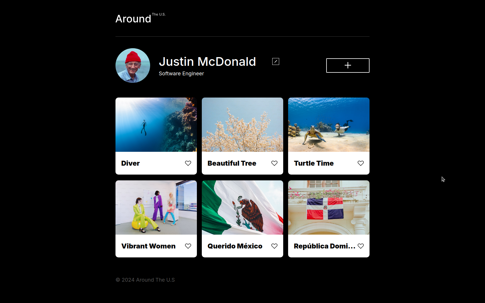

# Project 3: Around The U.S.

### Overview

- Intro
- Figma
- Images

**Intro**

This project, titled Around the US, is my first project using a figma design. It was an interesting set of challenges using HTML, and CSS. I used the grid property to set up the layout of the cards. I used Javascript to give the edit profile button functionality, which updates the information on the user's profile accordingly

**Technologies**

- HTML
- CSS
- Javascript

**Figma**

- [Link to the project on Figma](https://www.figma.com/file/ii4xxsJ0ghevUOcssTlHZv/Sprint-3%3A-Around-the-US?node-id=0%3A1)

**Images**

- [Link to video example](https://www.loom.com/share/f97a6915dbe1449db9053f2024b60a17?sid=f8711af6-ce89-42db-a635-d3980aa9f0de)

**Github Pages Link**
https://peluchemoreno.github.io/se_project_aroundtheus/index.html

**Video Description**
https://drive.google.com/file/d/1iYdf16MzpEFVyEUoqppGz159i_a1kxMV/view?usp=sharing

Good luck and have fun!
