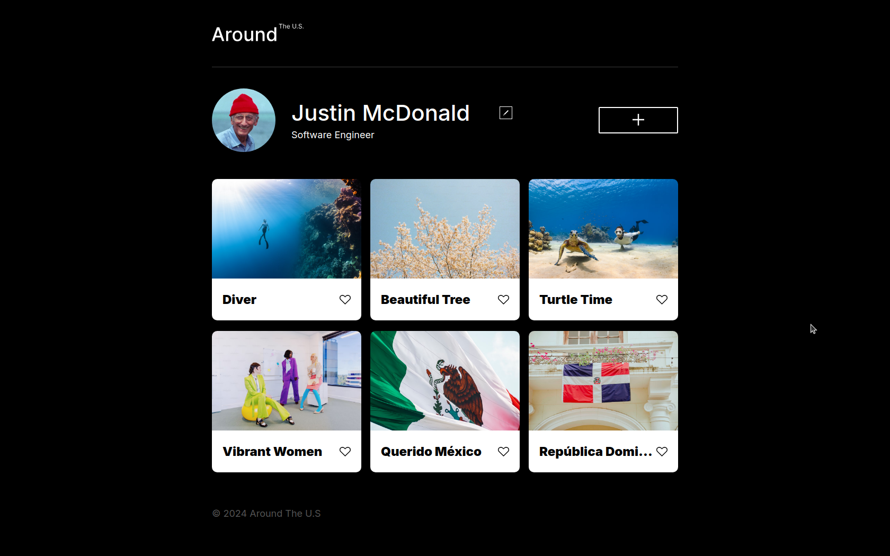

# Around The U.S.

This project is front end focused, responsive web application that allows a user to upload, like, view, and delete photos that they've added.

## Current functionality is as follows

- Add cards to the page
- View a card's full image when clicking or tapping on the image
- Deleting a card from the list
- URL, Name, and Description field validation
- Update user information (name and description)

## Technologies

- HTML
- CSS
- Javascript
- Figma
- REST API

## Previews/Demonstrations

## Links

- [Link to video example](https://www.loom.com/share/f97a6915dbe1449db9053f2024b60a17?sid=f8711af6-ce89-42db-a635-d3980aa9f0de)
- [Live demo](https://peluchemoreno.github.io/se_project_aroundtheus/index.html)
- [Video demo](https://drive.google.com/file/d/1iYdf16MzpEFVyEUoqppGz159i_a1kxMV/view?usp=sharing)
